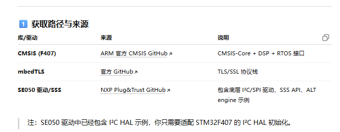

STM32F407 + SE050 + mbedTLS Demo (with ALT engine)

目录结构已生成，可直接用 CMake 或 Makefile 进行交叉编译。
ALT engine 示例绑定 SE050 密钥进行 TLS。

## 工程说明

1. 创建工程目录结构
STM32F407 + Plug & Trust + SE050 + mbedTLS 
可以直接建立 TLS 连接（客户端示例

2. 说明

- - CMSIS_5/： STM32F407 的 CMSIS 核心库
- - dtls/ → mbedTLS 库
- plug-and-trust/ → SE050 SSS API + 驱动 + 示例

3. 模拟双方 TLS+CERT 通信过程

┌─────────────────────────────┐
│          STM32F407          │
│  (你的主 MCU，跑 mbedTLS)   │
│                             │
│  ┌───────────────────────┐  │
│  │  mbedTLS (TLS Stack)  │  │
│  │  - TLS 握手           │  │
│  │  - X509 证书验证      │  │
│  │  - AES-GCM / SHA256   │  │
│  │  - ECC Key wrapper    │  │
│  └───────▲──────────────┘  │
│          │ mbedTLS 端口适配 │
└──────────┼──────────────────┘
           │ I2C / Secure API
┌──────────┼──────────────────┐
│          ▼                  │
│       NXP SE050             │
│  (硬件安全元件 Secure Element) │
│ - ECC 私钥存储（不可导出）   │
│ - CSR 生成                  │
│ - TLS 客户端证书签名         │
│ - ECDH 私钥运算             │
│ - AES-GCM / HMAC 加速       │
└─────────────────────────────┘

